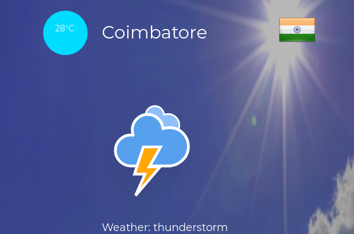
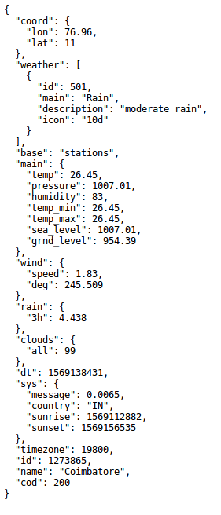
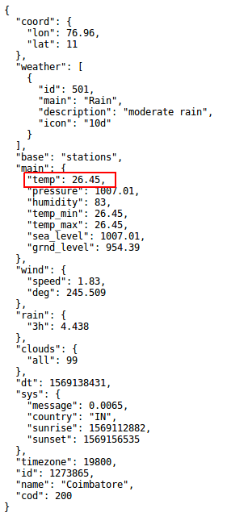

Hello World!

In this blog, I would like to share my learning and experiences in writing a simple JavaScript weather application. For writing this application I’ve used HTML, CSS, JavaScript languages and frameworks like Bootstrap for responsiveness.




# How do I get weather data?

Before getting into the application, let me tell you how I got the weather data. You might wonder how I could get weather data for cities all over the world. It is not a big deal as you think when we have APIs like <a href="https://openweathermap.org/">openweathermap</a>. I have used the openweathermap api to get weather data of cities all over the world.

You can do it by doing two simple steps.
- Create an account in openweathermap
- Generate an api key.

Now, let’s try to get some data from openweathermap.

`
https://api.openweathermap.org/data/2.5/weather?q=<<cityName>>&units=metric&apikey=<<key>>
`

Just copy-paste the above link and replace cityName with a city name and key with your api key. You will get a JSON response from openweathermap.



# What is JSON and how can I make use of it?

JSON stands for **J**ava**S**cript **O**bject **N**otation, a lightweight, an easily understandable format used for storing and transport data. It may look like a Jargon now, but it will not be a big deal once you understand this. JSON will have a key value pair. For example, in the above example, we have *“name” : “Coimbatore”*, where *“name”* is the key and *“Coimbatore”* is the value.

So now, we can get some information from the JSON. But before that, we need to know two things

- Anything enclosed by curly braces({}) in json are called json objects
- Anything enclosed by square braces([]) in json are called json array.

In the above example, *“coord”* is a JSON object and *“Weather”* is a JSON array.



The above screen shot is the JSON weather data of Coimbatore city. If we want to get the current temperature, we will need to find the “temp” in the JSON response. It is inside the “main” json object. So all we need to do is, we need to store the json response in a JavaScript object. From that object, we need to extract the “main” object. From main, we have to extract “temp”. So how to do this programmatically? Let’s see.

```javascript
link = "https://api.openweathermap.org/data/2.5/weather?q="+cityName+"&units=metric&apikey="+key;
var request = new XMLHttpRequest();
request.open('GET',link,true);
request.onload = function(){
 var obj = JSON.parse(this.response);
 if (request.status >= 200 && request.status < 400) {
 var temp = obj.main.temp;
 }
 else{
  console.log("The city doesn't exist! Kindly check");
 }
}
request.send();
```

Here we store the api link in a variable called ‘link’. We create an instance of XMLHttpRequest and we pass the link to it. If we get the JSON Response, we are storing it in variable called ‘obj’. We get the temperature from *obj.main.temp*. This is how we can parse data from JSON.

## Next Steps

We got the weather data. Now it’s time to present it to the user. I’ll briefly summarize what I did for this application.
- I got the city name from the user through textbox and pass that to api link
- If the city doesn’t exist in openweathermap, a message is given to the user that the city doesn’t exist with openweathermap.
- From <a href="https://www.amcharts.com/free-animated-svg-weather-icons/">www.amcharts.com</a> and <a href="https://www.flaticon.com/authors/epiccoders">EpicCoders</a> from <a href="https://www.flaticon.com/">www.flaticon.com</a>, got some interactive animated icons and used them accordingly with the weather data.
- Country flags are included to appropriate cities. This helped to identify some name conflicts with cities. We found some instances where the same city name found in more than one country. Example: “Salem” found in Tamilnadu, India, and Massachusetts, US; “Colombo” found in Sri Lanka and Brazil. When user search for Salem, it usually show the weather data of Massachusetts Salem. If we need the weather data of Salem in India, we will need to include the country code in search box.
- Example: Instead of searching “Salem”, we have to search “Salem,IN”. This will show the weather data of Salem in India. For showing the country flags, I have used an api called <a href="https://www.countryflags.io/">countryflags.io</a>.
- Forecast data for the next 24 hours in the interval of 3 hours is given.
- **Updated on 30-Sep-19:** Upgraded the application in such a way that, user location is fetched from device and weather data is provided to user based on the user latitude and longitude.
- Forecast weather details and animation given


This is how the application is created. You can try the application <a href="http://sriram23.github.io/Weather-Now">here</a>. Feel free to share your views on this. Looking forward to your valuable responses. I will meet you in the next blog post with the Android version of Weather Now.